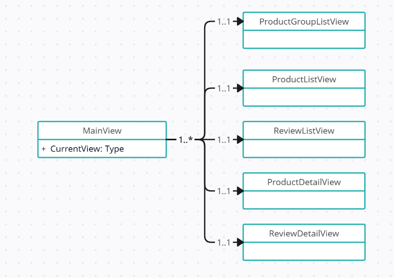

# Navigation
## Preparations
1) Open Microsoft SqlServer Management Studio
2) Connect to .\SqlExpress using Windows Authentication. Enable Trust Server Certificate
3) On right click on Databases and select Import Data-tier Application
4) Import from Local Disk: "D:\Exercises\Assets\ProductCatalog.bacpac"
5) Complete the wizard accepting all default values
## Introduction
We have a WPF application with a MainView and a bunch of component views (See diagram 1):
* ProductGroupListView (default)
* ProductListView
* ReviewListView
* ProductDetailView
* ReviewDetailView

From within Views the user can navigate to other views. For that the MainView needs to know which view.

### Exercise 1
What design pattern would you recommend and why?
### Exercise 2
Open [Starter/Application.sln](/Starter/Application.sln).
Try to implement the design pattern.
You'll find several TODO's in the existing code where navigation should occur.
